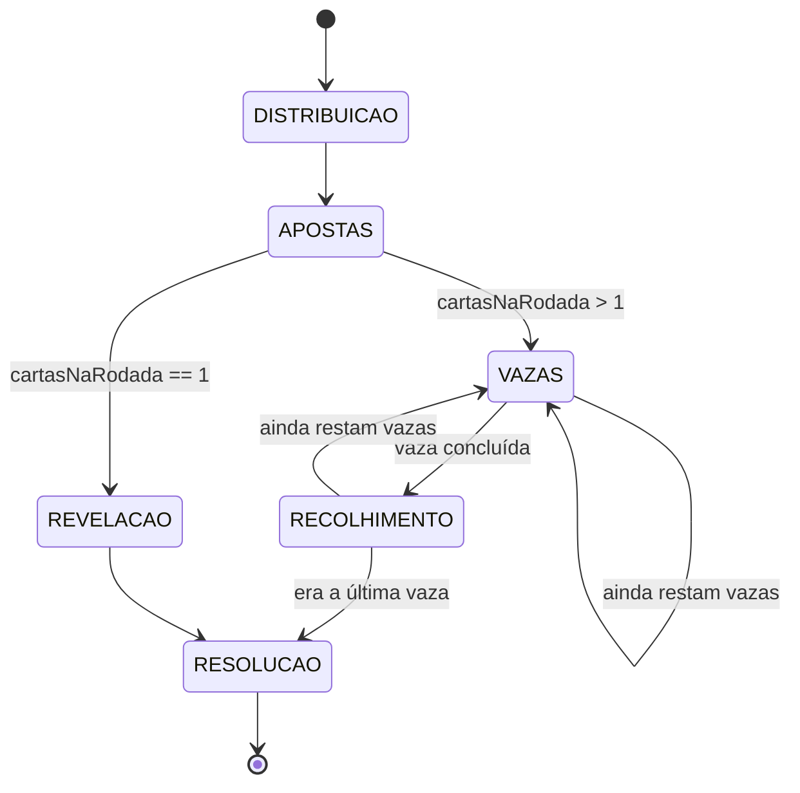

# 02 — Regras do Jogo

Status: **ESTÁVEL**

FDP é um jogo de vazas com aposta declarada e blefe, para 2 a 8 jogadores. Cada jogador
declara quantas vazas pretende ganhar na rodada e perde vidas na medida em que erra. Uma regra
estrutural garante que a soma das apostas **nunca** feche com o número de vazas disponíveis —
por isso alguém sempre se dá mal.

Referência: o jogo é da família do **Fodinha** brasileiro (parente do Oh Hell). Onde este
documento e a tradição divergirem, **este documento vence**.

## 1. Restrições herdadas

De [00-visao-e-escopo.md](./00-visao-e-escopo.md):

| # | Restrição |
|---|---|
| R1 | 2 a 8 jogadores |
| R2 | Partida de 10 a 20 minutos |
| R3 | Servidor é a única autoridade sobre o estado |
| R4 | Ausência de jogador é tratada por pausa, com saída sempre disponível (§3.8) |
| R5 | Estado oculto nunca trafega para quem não tem direito |
| R6 | As regras precisam caber em uma tela de ajuda |

---

## 2. Resumo em uma tela

Texto-base da tela de regras (RF-015):

> Cada rodada tem um número de cartas. Você aposta quantas vazas vai ganhar. Depois joga.
> Errou a aposta? Perde vidas — uma por vaza de diferença. Zerou as vidas, está fora.
> Último de pé vence.
>
> **A pegadinha:** a soma das apostas da mesa nunca pode bater com o número de vazas. O último
> a apostar é obrigado a estragar a conta de alguém.
>
> **A rodada de 1 carta:** você não vê a sua carta. Ela vai na sua testa e todo mundo vê,
> menos você. Aposte no escuro.
>
> **Mesa cheia:** com muita gente, entra mais de um baralho. Cartas repetidas passam a existir
> e empate vira coisa comum — e no empate, a vaza pode não ser de ninguém.

---

## 3. Regras formais

### 3.1 Objetivo e condição de vitória

| ID | Regra |
|---|---|
| RJ-001 | Cada jogador começa com `vidasIniciais` vidas (padrão 5, configurável). |
| RJ-002 | Ao fim de cada rodada, cada jogador perde `\|aposta − vazasGanhas\|` vidas. |
| RJ-003 | Um jogador cujas vidas chegam a 0 é **eliminado** e sai da partida imediatamente após o débito de vidas da rodada. |
| RJ-004 | A partida termina quando resta **1 jogador ativo**. Ele é o vencedor. |
| RJ-005 | Se **todos** os jogadores ativos restantes forem eliminados na mesma rodada, vence quem **morreu por último** dentro da rodada, conforme §3.1.1. |
| RJ-006 | As vidas de todos os jogadores são informação **pública** durante toda a partida. |

#### 3.1.1 Momento da morte

Numa rodada de N cartas, a eliminação só é aplicada no fim (RJ-003), mas o **instante em que a
queda se torna inevitável** é registrado vaza a vaza. É esse instante que desempata a vitória.

| ID | Regra |
|---|---|
| RJ-007 | O **desvio mínimo garantido** de um jogador, a qualquer momento da rodada, é: se `vazasGanhas > aposta`, vale `vazasGanhas − aposta`; se `vazasGanhas + vazasRestantes < aposta`, vale `aposta − (vazasGanhas + vazasRestantes)`; caso contrário, `0`. |
| RJ-008 | Um jogador **morre** na primeira vaza cuja resolução torna seu desvio mínimo garantido `≥` suas vidas correntes. O número dessa vaza é gravado em `mortoEmVaza`. |
| RJ-009 | Um jogador morto **continua jogando** todas as vazas restantes da rodada, normalmente. A morte é um registro, não uma saída antecipada. Exceção: RJ-014, quando não sobra ninguém para quem essas vazas ainda importem. |
| RJ-010 | Em RJ-005, vencem os jogadores com o **maior** `mortoEmVaza`. Se dois ou mais morreram na **mesma** vaza, todos eles vencem e `winnerIds` os contém. |
| RJ-011 | Todo jogador eliminado ao fim de uma rodada tem, necessariamente, `mortoEmVaza` preenchido. |
| RJ-012 | Na classificação final, jogadores eliminados na mesma rodada são ordenados por `mortoEmVaza` decrescente. |
| RJ-013 | `mortoEmVaza` é informação **pública**: qualquer um pode derivá-la das apostas e vazas, que já são públicas. |
| RJ-014 | **Vitória matemática.** Se, ao fim da pausa de uma vaza, restar **no máximo 1** jogador ativo ainda não morto (RJ-008), a rodada encerra ali: as vazas restantes não são jogadas e a rodada vai direto ao débito de vidas. |
| RJ-015 | Numa rodada encerrada por RJ-014, o débito de cada jogador é seu **desvio mínimo garantido** (RJ-007), e não `\|aposta − vazasGanhas\|`. |

**Exemplo (RJ-005).** Rodada de 7 cartas, três jogadores restantes, todos com 1 vida. Ana
aposta 0 e ganha uma vaza logo na primeira → morre na vaza 1. Beto aposta 3 e, na vaza 5, já
é impossível chegar a 3 → morre na vaza 5. Caio aposta 2 e só na vaza 7 fica claro que fará 1
→ morre na vaza 7. **Caio vence**: segurou a última vida por mais tempo.

RJ-009 importa para o resto da mesa: as cartas de um jogador já condenado continuam
disputando vazas e ainda decidem a vida dos outros.

**Por que RJ-014 não muda o vencedor.** É a única justificativa que sustenta a regra, então
fica escrita. O desvio mínimo garantido nunca diminui quando uma vaza é jogada (RJ-007):
ultrapassada a aposta, o excesso só cresce; ficando inalcançável, a falta só cresce. Logo,
quem morreu não ressuscita. Suponha que sobre um único vivo, P. Ou P chega vivo ao fim da
rodada, e vence por RJ-004 — todos os outros zeram as vidas; ou P também morre, numa vaza
necessariamente **posterior** à de todos os demais, e vence por RJ-010, por ter segurado a
última vida por mais tempo. Nos dois caminhos, P. Se não sobra vivo nenhum, a rodada já está
inteiramente decidida e RJ-010 aponta o vencedor pelo `mortoEmVaza` já gravado.

**Por que RJ-015 existe.** Cortada a rodada, cobrar `|aposta − vazasGanhas|` debitaria vazas
que ninguém teve a chance de disputar. O desvio mínimo garantido é o piso já provado, e é o
que se cobra. RJ-002 é o **caso particular** de RJ-015 com a rodada inteira jogada: ali
`vazasRestantes` é 0 e as duas fórmulas dão o mesmo número, sempre (CA-354). Uma consequência
útil: o único sobrevivente nunca é eliminado pelo corte, porque não estar morto significa,
por definição, piso menor que as vidas.

RJ-014 é regra de jogo, e não corte de tela: muda o estado da partida no servidor, e por isso
vive aqui. A mesa **DEVE** dizer que a rodada foi encerrada por decisão (`07` §2.4) — partida
que acaba com cartas na mão de todo mundo, sem explicação, parece defeito.

### 3.2 Composição do baralho

| ID | Regra |
|---|---|
| RJ-020 | A unidade é o baralho francês padrão de **52 cartas**, sem coringas. |
| RJ-021 | Valores, em ordem crescente: `2 3 4 5 6 7 8 9 10 J Q K A`. `A` é a carta mais alta. |
| RJ-022 | **Naipe não tem efeito algum** sobre o jogo. É apenas ilustração da carta. |
| RJ-023 | Não existe obrigação de seguir naipe. Qualquer carta da mão é sempre jogável. |
| RJ-024 | O número de baralhos da rodada é `baralhos = ceil(jogadoresAtivos × cartasNaRodada / 52)`, com mínimo de 1. |
| RJ-025 | Os baralhos são embaralhados **juntos**, como um sabot único de `52 × baralhos` cartas. |
| RJ-026 | Com mais de um baralho existem **cartas idênticas em valor e naipe**. Elas são cartas distintas (`CardId` distintos) e empatam entre si normalmente. |
| RJ-027 | O sabot é regerado e reembaralhado **a cada rodada**. Cartas não se acumulam entre rodadas. |

Valor numérico usado na comparação:

| Carta | 2 | 3 | 4 | 5 | 6 | 7 | 8 | 9 | 10 | J | Q | K | A |
|---|---|---|---|---|---|---|---|---|---|---|---|---|---|
| Valor | 2 | 3 | 4 | 5 | 6 | 7 | 8 | 9 | 10 | 11 | 12 | 13 | 14 |

RJ-024 substitui qualquer limite artificial de cartas por jogador: a mesa cresce, o número de
baralhos acompanha. Com 8 jogadores e 7 cartas são 56 cartas — 2 baralhos.

**Consequência de projeto (RJ-026):** a partir de 2 baralhos, empates deixam de ser raridade e
viram mecânica corrente. O modo de empate escolhido no lobby (§3.10) passa a ter peso
estratégico grande, e vazas anuladas ficam frequentes em `EMPATE_ANULA_VAZA`. Isso é
comportamento pretendido, não defeito — mas **DEVE** ser comunicado no lobby (RJ-134).

### 3.3 Setup da partida

| ID | Regra |
|---|---|
| RJ-030 | A ordem dos jogadores na mesa (`playerOrder`) é sorteada no início da partida e **não muda** até o fim. "Sentido horário" = avançar nesse array. |
| RJ-031 | O primeiro apostador da **rodada 1** é sorteado. |
| RJ-032 | Todos começam com `vidasIniciais` vidas. |
| RJ-033 | A rodada 1 tem **1 carta**. |
| RJ-034 | Todo o setup é determinístico a partir de `(seed, playerOrder, options)`. |

### 3.4 Progressão das rodadas

| ID | Regra |
|---|---|
| RJ-035 | O número de cartas cresce de 1 em 1 a cada rodada até atingir o teto `M = maxCartasPorRodada`, e então **volta a 1**. É serrote, não vai-e-volta: `1,2,3,4,5,6,7,1,2,3,…` |
| RJ-036 | `cartasNaRodada(r) = cartasNaRodada(r-1) >= M ? 1 : cartasNaRodada(r-1) + 1`, com `cartasNaRodada(1) = 1`. |
| RJ-037 | `M` **não** é reduzido por número de jogadores. A limitação física é resolvida por baralhos adicionais (RJ-024). |
| RJ-038 | O primeiro apostador **rotaciona**: a cada rodada passa ao próximo jogador **ativo** em sentido horário a partir do primeiro apostador da rodada anterior. |
| RJ-039 | Se o primeiro apostador da rodada anterior deixou a partida, a rotação parte da posição que ele ocupava em `playerOrder` e avança até o próximo jogador ativo. |

### 3.5 Anatomia da rodada



| Fase | Quem age | Ação | Timer |
|---|---|---|---|
| `DISTRIBUICAO` | ninguém | Servidor monta o sabot, embaralha e distribui | — |
| `APOSTAS` | um por vez, em ordem | `move:bet` | `BET_TIMEOUT` |
| `VAZAS` | um por vez, em ordem | `move:playCard` | `PLAY_TIMEOUT` |
| `RECOLHIMENTO` | ninguém | Vaza fechada ainda na mesa, antes de recolher (`07` §2.4) | pausa fixa |
| `REVELACAO` | ninguém | Cartas de testa reveladas aos donos | pausa fixa |
| `RESOLUCAO` | ninguém | Débito de vidas, eliminações, fim de partida | pausa fixa |

**Todas as fases são sequenciais.** Não existe ação simultânea e não existe ação fora do turno.
Em qualquer instante, no máximo um jogador tem o direito de agir.

#### 3.5.1 `DISTRIBUICAO`

| ID | Regra |
|---|---|
| RJ-040 | Monta-se o sabot com `baralhos` baralhos (RJ-024) e embaralha-se com Fisher-Yates usando o RNG semeado da partida. |
| RJ-041 | Distribui-se `cartasNaRodada` cartas a cada jogador ativo, uma por vez, em `playerOrder`, a partir do primeiro apostador. |
| RJ-042 | As cartas restantes formam o monte, que **não é usado** nesta rodada e permanece oculto de todos. |
| RJ-043 | Por construção de RJ-024, o sabot **sempre** tem cartas suficientes. Violação é bug de severidade 1. |

#### 3.5.2 `APOSTAS`

| ID | Regra |
|---|---|
| RJ-050 | A ordem de aposta é: primeiro apostador da rodada, e daí em sentido horário por todos os jogadores ativos. |
| RJ-051 | Uma aposta é um inteiro no intervalo `[0, cartasNaRodada]`. |
| RJ-052 | Cada aposta é **pública** assim que declarada. Quem aposta depois vê todas as anteriores. |
| RJ-053 | **Regra da soma proibida:** ao final da fase, `soma(apostas) ≠ cartasNaRodada`. |
| RJ-054 | A restrição de RJ-053 recai **exclusivamente sobre o último apostador**. Seu valor proibido é `cartasNaRodada − soma(apostasAnteriores)`. |
| RJ-055 | Se o valor proibido de RJ-054 estiver fora de `[0, cartasNaRodada]`, o último apostador não tem restrição alguma. |
| RJ-056 | Uma aposta que viole RJ-054 é rejeitada com `ERR-007` e motivo `SOMA_PROIBIDA`. |

Como o intervalo tem no mínimo 2 valores (`0` e `1`) e apenas 1 pode ser proibido, o último
apostador **sempre** tem ao menos uma aposta legal. A fase nunca trava.

**Exemplo (5 jogadores, 2 cartas):** apostas anteriores `0, 0, 1, 0` somam 1. Valor proibido do
último = `2 − 1 = 1`. Ele pode apostar `0` (soma 1) ou `2` (soma 3). Não pode apostar `1`.

#### 3.5.3 `VAZAS` — só quando `cartasNaRodada > 1`

| ID | Regra |
|---|---|
| RJ-060 | A rodada tem exatamente `cartasNaRodada` vazas. |
| RJ-061 | A **primeira vaza** é puxada pelo primeiro apostador da rodada. |
| RJ-062 | Dentro de uma vaza, joga-se em sentido horário a partir de quem puxou, uma carta por jogador ativo. |
| RJ-063 | Qualquer carta da própria mão é uma jogada legal (decorre de RJ-023). |
| RJ-064 | Encerrada a vaza, seu vencedor é determinado por §3.6.1 e ganha 1 vaza. |
| RJ-065 | O puxador da vaza seguinte é definido por §3.6.2. |
| RJ-066 | Cartas jogadas ficam **públicas** e permanecem visíveis na mesa até o fim da vaza. |

#### 3.5.4 `REVELACAO` — só quando `cartasNaRodada == 1`

| ID | Regra |
|---|---|
| RJ-070 | Na rodada de 1 carta, a carta vai **na testa**: o dono **não** a vê; todos os outros veem. |
| RJ-071 | Isso vale em **toda** rodada de 1 carta — a rodada 1 e todo reinício de ciclo. |
| RJ-072 | Não há fase de vazas: a única carta de cada jogador já está na mesa desde a distribuição. |
| RJ-073 | Encerradas as apostas, todas as cartas são reveladas aos seus donos simultaneamente e a vaza única é resolvida por §3.6.1. |
| RJ-074 | Para efeito de §3.6.2, a ordem de jogada da vaza única é a ordem de aposta. |
| RJ-075 | Numa rodada de testa, todos os jogadores que morrem, morrem na vaza 1 — logo, por RJ-010, empatam entre si. |

### 3.6 Resolução

#### 3.6.1 Vencedor da vaza

Depende de `regraEmpate`, definida no lobby.

**Modo `EMPATE_ANULA_VAZA`** (empate no topo → ninguém ganha a vaza):

```
maiorValor = max(valor de todas as cartas da vaza)
empatados  = jogadores cuja carta tem maiorValor
se |empatados| == 1 → esse jogador vence a vaza
senão              → ninguém vence a vaza
```

**Modo `EMPATE_ANULA_CARTAS`** (cartas empatadas se anulam; vence a maior restante):

```
restantes = todas as cartas da vaza
enquanto restantes não estiver vazio:
    maiorValor = max(valor em restantes)
    empatados  = cartas em restantes com maiorValor
    se |empatados| == 1 → esse jogador vence a vaza; fim
    senão              → remove todos os empatados de restantes; continua
ninguém vence a vaza
```

| Mesa | `ANULA_VAZA` | `ANULA_CARTAS` |
|---|---|---|
| `A K 5 3` | A vence | A vence |
| `A A K 5 3` | ninguém | **K vence** |
| `A A K K 5` | ninguém | **5 vence** |
| `A A K K` | ninguém | ninguém |
| `A A A A A` | ninguém | ninguém |

| ID | Regra |
|---|---|
| RJ-080 | Uma vaza sem vencedor **não é creditada a ninguém**. A soma de vazas ganhas na rodada pode ser menor que `cartasNaRodada`. |
| RJ-081 | O modo de empate é fixado no início da partida e não muda durante ela. |

RJ-080 tem consequência estratégica direta, amplificada por RJ-026: com múltiplos baralhos e
`EMPATE_ANULA_VAZA`, apostas altas ficam bem mais arriscadas, porque vazas evaporam com
frequência.

#### 3.6.2 Quem puxa a vaza seguinte

| ID | Regra |
|---|---|
| RJ-085 | Se a vaza teve vencedor, **ele** puxa a próxima. |
| RJ-086 | Se a vaza não teve vencedor, puxa **o responsável pelo empate**: o **último jogador, na ordem de jogada daquela vaza**, a jogar uma carta do valor empatado mais alto. |
| RJ-087 | Em `ANULA_CARTAS` com múltiplos grupos anulados e nenhum vencedor, considera-se o **grupo de valor mais alto** para aplicar RJ-086. |

**Exemplo de RJ-086:** ordem de jogada `P1:K`, `P2:A`, `P3:5`, `P4:A`. Valor empatado mais alto
= A, jogado por P2 e P4. O último a jogá-lo foi **P4** — ele puxa a vaza seguinte.

#### 3.6.3 Débito de vidas e registro de mortes

| ID | Regra |
|---|---|
| RJ-090 | Ao fim da rodada, para cada jogador ativo: `vidasPerdidas = \|aposta − vazasGanhas\|`. |
| RJ-091 | Acertar a aposta em cheio custa **0 vidas**. |
| RJ-092 | Vidas nunca ficam negativas: são limitadas a 0. |
| RJ-093 | O débito de **todos** os jogadores é calculado antes de qualquer eliminação, para que RJ-005 seja resolvível. |
| RJ-094 | Jogadores que chegam a 0 são eliminados simultaneamente, e ordenados entre si por RJ-012. |
| RJ-095 | Ao resolver **cada** vaza, o servidor recalcula RJ-007 para todo jogador ativo e grava `mortoEmVaza` conforme RJ-008. |
| RJ-096 | `mortoEmVaza` é reiniciado no começo de cada rodada. |
| RJ-097 | Na rodada de testa, o cálculo de RJ-095 ocorre uma única vez, na resolução da vaza única. |

**Exemplo:** rodada de 3 cartas. Apostou 2, ganhou 2 → perde 0. Apostou 2, ganhou 0 → perde 2.
Apostou 0, ganhou 1 → perde 1.

### 3.7 Visibilidade da informação

Matriz canônica; implementa `04` §5 e as invariantes INV-07 e INV-13.

| Informação | Dono | Outros jogadores | Espectador |
|---|---|---|---|
| Mão própria, rodada de N>1 cartas | **vê** | conta apenas | conta apenas |
| Mão própria, rodada de 1 carta (testa) | **NÃO vê** | **vê a carta** | **vê a carta** |
| Cartas já jogadas na vaza corrente | vê | vê | vê |
| Vazas de rodadas anteriores | vê | vê | vê |
| Apostas já declaradas | vê | vê | vê |
| Vidas de todos | vê | vê | vê |
| Vazas ganhas na rodada corrente | vê | vê | vê |
| `mortoEmVaza` | vê | vê | vê |
| Número de baralhos em uso | vê | vê | vê |
| Monte não distribuído | oculto | oculto | oculto |
| `seed` da partida | oculto | oculto | oculto |

| ID | Regra |
|---|---|
| RJ-100 | Na rodada de 1 carta, **enquanto as apostas estão abertas**, o `PlayerView` de um jogador **NÃO DEVE** conter, em nenhuma profundidade, o valor nem o naipe da própria carta — nem cifrado, nem codificado. Na fase `REVELACAO` ela passa a constar, para todos. |
| RJ-101 | Na rodada de 1 carta, o `PlayerView` **DEVE** conter as cartas de todos os demais. |
| RJ-102 | Em rodadas de N>1, o `PlayerView` **NÃO DEVE** conter carta alguma da mão alheia. |

RJ-100 é a regra de segurança mais delicada do jogo: é a única em que o servidor envia ao
cliente cartas que ele exibe mas cujo equivalente próprio precisa ser suprimido. Ela tem
teste dedicado na projeção (CA-281) e no fio (CA-285).

O recorte "enquanto as apostas estão abertas" não afrouxa nada: o segredo existe para que a
aposta seja às cegas, e em `REVELACAO` não há mais aposta a fazer. Sem esse recorte o dono
era o **único da mesa que nunca via a própria carta** — todos os outros a viram a rodada
inteira, e ele passava direto para o acerto de contas sem saber o que tinha tirado. É o que
CA-347 cobra, e `07` RF-035 já dizia ao marcar a fronteira em EV-023 e não na rodada.

### 3.8 Ausência, pausa e tempo

O tratamento depende de o jogador estar **conectado** ou **desconectado**. São mecanismos
diferentes porque os casos são diferentes: quem está online pode agir e escolheu não agir;
quem caiu não tem como.

#### 3.8.1 Jogador conectado que não age

| ID | Regra |
|---|---|
| RJ-110 | `BET_TIMEOUT` = 45 s. Prazo do jogador da vez na fase de apostas. |
| RJ-111 | `PLAY_TIMEOUT` = 30 s. Prazo do jogador da vez na fase de vazas. |
| RJ-112 | Os prazos de RJ-110 e RJ-111 aplicam-se **apenas a jogador `CONECTADO`**. |
| RJ-113 | Estourado o prazo, o servidor executa o **auto-play** e a partida avança. |
| RJ-114 | Auto-play em `APOSTAS`: aposta **0**; se 0 for proibido por RJ-054, aposta **1**. |
| RJ-115 | Auto-play em `VAZAS`: joga a carta de **menor valor** da mão; empate de valor resolve pelo menor `CardId` (determinístico). |
| RJ-116 | Todo auto-play **DEVE** gerar `EV-024` visível na mesa, identificando o jogador. |

O auto-play para jogador conectado existe para que ninguém consiga travar a mesa
deliberadamente — deixar o app aberto e não jogar não pode ser estratégia. RJ-114 aposta 0
por ser a aposta mais conservadora.

#### 3.8.2 Jogador desconectado: a partida pausa

| ID | Regra |
|---|---|
| RJ-117 | Um jogador só entra em `DESCONECTADO` depois de ficar **sem socket por `TRANSPORT_GRACE`** (10 s). Aí sim a partida entra em `PAUSADA`, em qualquer fase. |
| RJ-117a | Queda de socket seguida de reconexão dentro de `TRANSPORT_GRACE` **NÃO** é ausência: não pausa, não notifica, não conta para `RECONNECT_GRACE`. |
| RJ-118 | Em `PAUSADA`, nenhum comando de jogada é aceito e **nenhum timer de turno corre**. |
| RJ-119 | Quando **todos** os ausentes reconectam, a partida retoma automaticamente do ponto exato em que parou, e os timers de turno reiniciam do zero. |

RJ-118 e RJ-119 juntos garantem que ninguém volta de uma queda de conexão já com o prazo
estourado.

**Por que RJ-117a existe.** Socket que cai não é jogador que sumiu. 4G instável, túnel,
elevador, troca de Wi-Fi para dados móveis: o celular perde a conexão por dois ou três segundos
o tempo todo, e a pessoa nem percebe. Sem a carência, cada um desses tremores pausaria a mesa
inteira — em oito celulares, a partida viveria pausada. A carência isola o transporte do jogo,
que é a única distinção que importa para quem está jogando. Ver `11` §3.2.

#### 3.8.3 Resolução da ausência

| ID | Regra |
|---|---|
| RJ-150 | Após `RECONNECT_GRACE` (60 s) de pausa contínua, o **host** recebe a escolha: **encerrar a partida** ou **continuar sem os ausentes**. |
| RJ-151 | Antes de `RECONNECT_GRACE`, a UI apenas informa a espera; nenhuma decisão é oferecida. |
| RJ-152 | Se o próprio host está ausente, a sucessão de host (RF-013) transfere a decisão a um jogador conectado. |
| RJ-153 | **Encerrar:** a partida vai a `FIM_DE_PARTIDA` com `endReason: ENCERRADA_POR_AUSENCIA`, sem vencedor. |
| RJ-154 | **Continuar sem:** cada ausente é **retirado** da partida — cartas descartadas, vidas descartadas, `playerOrder` recomposto. Retirada **não** é eliminação e não gera `mortoEmVaza`. |
| RJ-155 | A rodada corrente é **abortada e redistribuída** do zero com os jogadores restantes, mantendo `roundNumber`. Apostas e vazas da rodada abortada são descartadas e **nenhuma vida é debitada**. |
| RJ-156 | Se a retirada deixa exatamente 1 jogador, a partida encerra com `endReason: VITORIA_POR_ABANDONO` e ele em `winnerIds`. Se deixa 0, a sala volta ao lobby. |
| RJ-157 | `PAUSE_MAX` = 10 min. Esgotado sem decisão nem reconexão, a partida encerra sozinha como RJ-153. |

RJ-157 é a trava que impede a pausa de virar partida travada — o modo de falha mais grave do
produto (`00` §7). Sem ela, uma sala fica presa em `PAUSADA` até o TTL, e o alerta de RNF-092
dispara sem que ninguém possa fazer nada.

> **Decisão revisável.** Pausar em toda queda de conexão troca "a partida nunca para" por "a
> partida nunca continua sem você". Numa mesa de 8 pessoas no celular, uma conexão instável
> pausa o jogo repetidamente. Se as métricas de pausas por partida (`09` §5) mostrarem que
> isso incomoda, a alternativa natural é voltar ao auto-play também para desconectados, com a
> pausa reservada ao jogador da vez.

### 3.9 Casos de borda

| ID | Situação | Regra |
|---|---|---|
| RJ-120 | Restam 2 jogadores | Tudo se aplica sem alteração. Na rodada de 1 carta, a aposta do segundo é frequentemente forçada por RJ-054 — comportamento correto, não bug. |
| RJ-121 | Jogadores ativos caem a 1 | Partida encerra com esse jogador como vencedor (RJ-004). |
| RJ-122 | Todos os ativos zeram vidas na mesma rodada | Vence quem morreu por último (RJ-005, RJ-010). |
| RJ-158 | Resta 1 ou 0 ativos ainda não mortos, com vazas por jogar | A rodada encerra na hora (RJ-014); o débito sai pelo piso de RJ-015. |
| RJ-123 | Todos morrem na mesma vaza | Todos vencem, `winnerIds` os contém (RJ-010). |
| RJ-124 | Todas as vazas de uma rodada são anuladas | Todos ganharam 0 vazas; quem apostou 0 não perde vida. Situação legítima e comum com múltiplos baralhos. |
| RJ-125 | Sabot insuficiente | Impossível por RJ-024. **DEVE** haver asserção defensiva (RJ-043). |
| RJ-126 | Jogador desconecta no meio da fase de apostas | Partida pausa (RJ-117); ao retomar, ele aposta normalmente. |
| RJ-127 | Jogadores **saem** deixando menos de 2 ativos | Partida encerra por RJ-156. |
| RJ-128 | Retirada por RJ-154 durante a fase de vazas | A rodada é abortada por RJ-155; ninguém perde vida por ela. |
| RJ-129 | Classificação de retirados | Retirados ficam abaixo de todos os eliminados, ordenados por retirada mais recente primeiro. |

### 3.10 Configurações da partida

Definidas pelo host no lobby, imutáveis durante a partida.

```ts
interface MatchOptions {
  vidasIniciais: number;              // 1..10, padrão 5
  maxCartasPorRodada: number;         // 1..10, padrão 7
  regraEmpate: 'EMPATE_ANULA_VAZA' | 'EMPATE_ANULA_CARTAS';  // padrão EMPATE_ANULA_CARTAS
}
```

| ID | Regra |
|---|---|
| RJ-130 | As opções **DEVEM** ser visíveis a todos no lobby antes do início, não só ao host. |
| RJ-131 | Alterar opções **DEVE** emitir `EV-007` a todos. |
| RJ-132 | As opções vigentes **DEVEM** ficar consultáveis durante a partida, na tela de regras. |
| RJ-133 | O lobby **DEVE** exibir quantos baralhos a configuração vai exigir no pico (`ceil(jogadores × maxCartasPorRodada / 52)`). |
| RJ-134 | Quando o pico exigir mais de 1 baralho, o lobby **DEVE** avisar que haverá cartas repetidas e mais empates (RJ-026). |

---

## 4. Requisito de implementação

`RF-006` só é entregue quando as regras acima estiverem implementadas como **função pura e
determinística**, isolada de rede e framework:

```ts
function aplicarJogada(
  estado: EstadoPartida,
  jogada: Jogada,
  ctx: { now: number; rng: Rng },
): { estado: EstadoPartida; eventos: Evento[] } | { erro: CodigoErro; motivo: string }
```

| ID | Regra |
|---|---|
| RJ-140 | A função **NÃO DEVE** usar `Date.now()` nem `Math.random()` diretamente; ambos entram por `ctx` (RNF-100). |
| RJ-141 | Toda partida **DEVE** ser reproduzível a partir de `(seed, options, playerOrder, jogadas[])`. |
| RJ-142 | A função **DEVE** ser testável sem servidor, sem WebSocket e sem navegador. |
| RJ-143 | O módulo de regras **NÃO DEVE** importar nada de UI, rede ou store (`11` §4). |
| RJ-144 | O `seed` é gerado por CSPRNG (RNF-074) e alimenta um PRNG determinístico. A imprevisibilidade vem do segredo do seed; a reprodutibilidade, do determinismo do PRNG. |

RJ-141 é o que permite anexar um seed e uma lista de jogadas a um relatório de bug e
reproduzir o defeito exatamente. RJ-144 resolve a tensão aparente entre "embaralhamento
criptograficamente seguro" e "setup determinístico": um seed imprevisível, um embaralhamento
determinístico a partir dele.

---

## 5. Rastreabilidade

Toda regra `RJ-###` desta seção **DEVE** ter ao menos um critério de aceite correspondente em
[10-criterios-de-aceite.md](./10-criterios-de-aceite.md) §4 (RNF-102).
