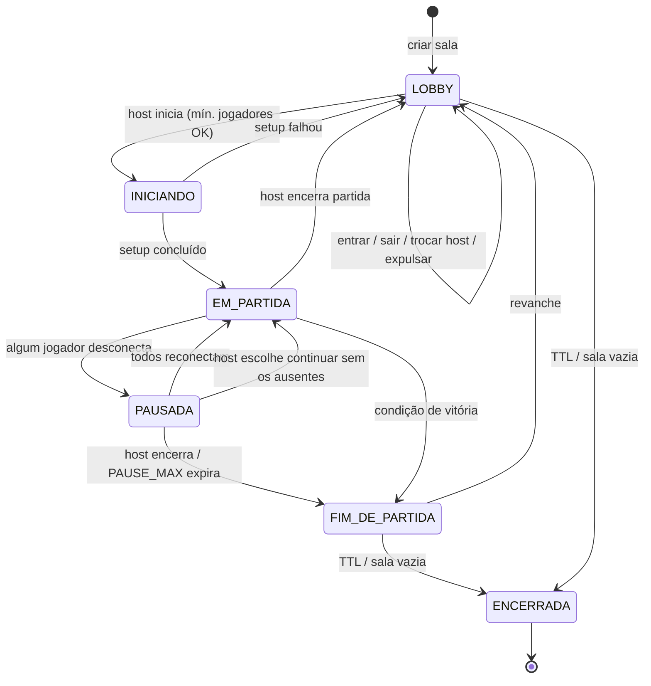
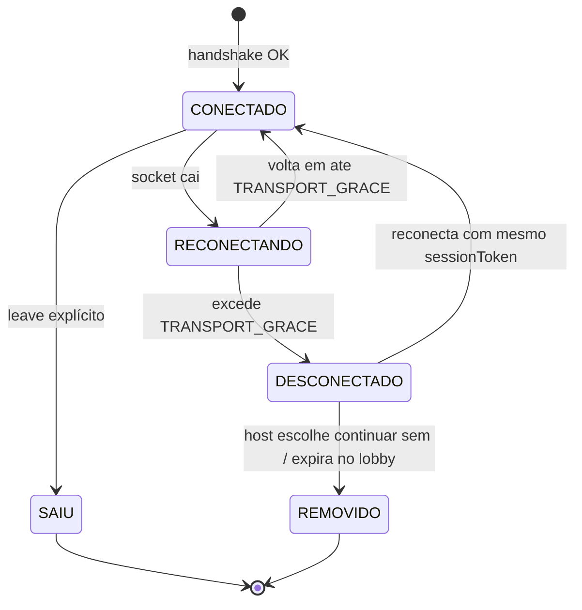
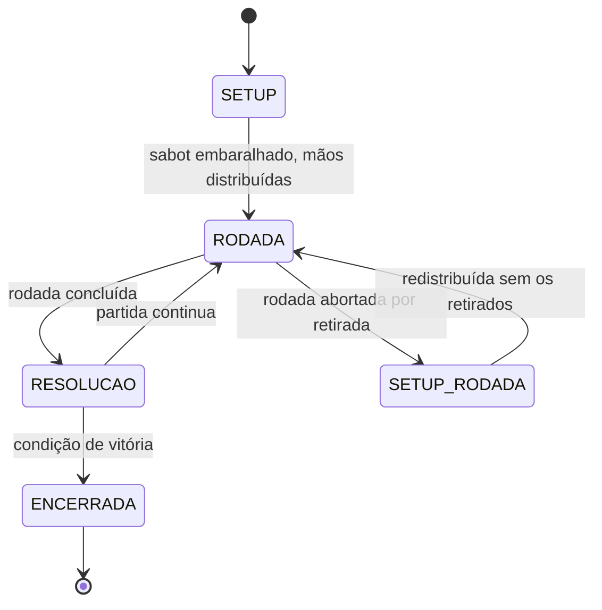
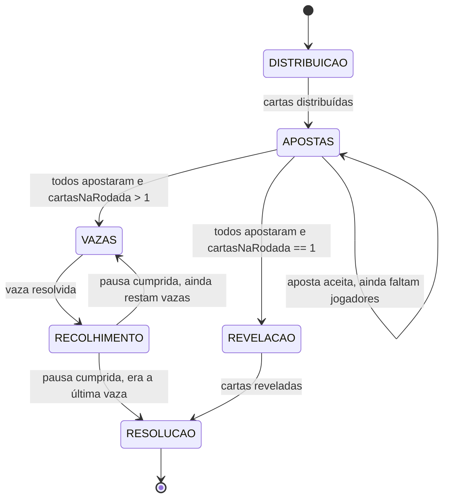

# 03 — Máquina de Estados

Status: **ESTÁVEL**

Existem três máquinas de estado independentes e sobrepostas: a **sala**, a **conexão de cada
jogador** e a **partida**. Confundi-las é a origem mais comum de bugs de "partida travada".

## 1. Sala



| Estado | Significado | Comandos aceitos |
|---|---|---|
| `LOBBY` | Aguardando início | `join`, `leave`, `setProfile`, `kick`, `startMatch`, `setOptions` |
| `INICIANDO` | Setup em execução; transitório, dura milissegundos | nenhum |
| `EM_PARTIDA` | Partida em andamento | jogadas de `02` §3.5, `leave`, `endMatch` (host) |
| `PAUSADA` | Partida congelada por ausência (`02` §3.8.2) | `resolveAbsence` (host, após grace), `leave` |
| `FIM_DE_PARTIDA` | Classificação final exibida | `rematch` (host), `leave`, `backToLobby` |
| `ENCERRADA` | Sala descartada; código pode ser reciclado | nenhum |

### 1.1 Regras

- **RF-013 — sucessão de host:** se o host sai ou desconecta, o host passa para o jogador
  **conectado** com o menor `joinedAt`. Em `PAUSADA` isso é essencial: a decisão de RJ-150
  precisa de um host presente (RJ-152).
- Entrar durante `EM_PARTIDA` ou `PAUSADA` **DEVE** admitir a pessoa como **espectador**
  (RF-014). Ela é promovida a jogador na transição `FIM_DE_PARTIDA → LOBBY`.
- `INICIANDO` **NÃO DEVE** ser observável na UI como tela própria; é guarda contra dois
  `startMatch` concorrentes.
- **Desconexão de espectador NÃO pausa a partida.** Só jogadores da partida ativam RJ-117.

### 1.2 O estado `PAUSADA`

| Momento | Comportamento |
|---|---|
| Entrada | Um jogador passa `TRANSPORT_GRACE` sem socket e vai a `DESCONECTADO` (RJ-117) |
| Durante | Nenhuma jogada aceita; todos os timers de turno **suspensos** (RJ-118) |
| 0–60 s | UI informa a espera. Nenhuma decisão oferecida (RJ-151) |
| ≥ 60 s | Host recebe a escolha **encerrar** / **continuar sem** (RJ-150) |
| Saída A | Todos reconectam → volta a `EM_PARTIDA`, timers reiniciam do zero (RJ-119) |
| Saída B | Host escolhe continuar sem → ausentes retirados, rodada abortada e redistribuída (RJ-154, RJ-155) |
| Saída C | Host escolhe encerrar → `FIM_DE_PARTIDA`, `ENCERRADA_POR_AUSENCIA` (RJ-153) |
| Saída D | `PAUSE_MAX` (10 min) expira → mesmo que a Saída C (RJ-157) |

Se um ausente reconecta no exato instante em que o host confirma "continuar sem", os dois
comandos são serializados por sala (`11` §5) e vence o que chegar primeiro. Não há estado
intermediário observável.

## 2. Conexão do jogador

Ortogonal à máquina da sala.



| Estado | No lobby | Em partida |
|---|---|---|
| `CONECTADO` | Normal | Normal; sujeito aos timers de turno (RJ-112) |
| `RECONECTANDO` | Normal | **Invisível ao jogo**: nada pausa, nada é notificado. Cobre a reciclagem periódica de socket da plataforma (RJ-117a) |
| `DESCONECTADO` | Some da lista após `RECONNECT_GRACE` | **Pausa a partida** (RJ-117). Vidas, apostas e mão preservadas intactas |
| `REMOVIDO` | Removido da sala | **Retirado** da partida: cartas e vidas descartadas (RJ-154). Não é eliminação |
| `SAIU` | Removido da sala | Equivale a `REMOVIDO`, sem esperar decisão do host |

A distinção entre **eliminado** e **retirado** é normativa: eliminado zerou as vidas jogando e
entra na classificação por `mortoEmVaza` (RJ-012); retirado saiu por ausência e fica abaixo de
todos os eliminados (RJ-129).

### 2.1 Temporizadores

| Timer | Valor | Escopo | Efeito ao expirar |
|---|---|---|---|
| `TRANSPORT_GRACE` | 10 s | Socket ausente | `CONECTADO → DESCONECTADO`; só aqui a partida pausa (RJ-117) |
| `RECONNECT_GRACE` | 60 s | Pausa contínua | Host passa a poder decidir (RJ-150) |
| `PAUSE_MAX` | 10 min | Pausa contínua | Partida encerra sozinha (RJ-157) |
| `BET_TIMEOUT` | 45 s | Jogador **conectado** da vez | Auto-play: 0, ou 1 se proibido (RJ-114) |
| `PLAY_TIMEOUT` | 30 s | Jogador **conectado** da vez | Auto-play: menor carta da mão (RJ-115) |
| `LOBBY_IDLE` | 15 min | Sala sem ninguém conectado | Sala → `ENCERRADA` |
| `ROOM_MAX_LIFE` | 4 h | Desde a criação | Sala → `ENCERRADA` |

Regras de interação, que evitam os bugs clássicos de timer:

- `BET_TIMEOUT` e `PLAY_TIMEOUT` **DEVEM** ser suspensos ao entrar em `PAUSADA` e **reiniciados
  do zero** ao sair (RJ-118, RJ-119). Nunca retomados de onde pararam.
- `RECONNECT_GRACE` e `PAUSE_MAX` contam **pausa contínua**: uma reconexão que retome a partida
  zera ambos.
- Se um jogador reconecta e outro cai no mesmo intervalo, a pausa é **contínua** e os
  contadores **não** zeram — senão duas pessoas alternando quedas seguram a sala para sempre.

## 3. Partida



- `SETUP` **DEVE** ser determinístico a partir de `(seed, playerOrder, options)` (RJ-034).
- `RESOLUCAO` é o único ponto onde vidas mudam e eliminações ocorrem.
- A condição de vitória é verificada **uma única vez por rodada**, em `RESOLUCAO`.
- `SETUP_RODADA` implementa RJ-155: mantém `roundNumber`, redistribui do zero, **não** debita
  vidas pela rodada abortada e **não** registra `mortoEmVaza`.

## 4. Fases da rodada

Sub-máquina interna do estado `RODADA`. Detalhe normativo em [02](./02-regras-do-jogo.md) §3.5.



| Fase | Tipo | Ator | Comando aceito | Timer | Saída |
|---|---|---|---|---|---|
| `DISTRIBUICAO` | automática | servidor | nenhum | — | Cartas distribuídas (RJ-041) |
| `APOSTAS` | **sequencial** | `activePlayerId` | `move:bet` | `BET_TIMEOUT`, só se conectado | Todos os ativos apostaram |
| `VAZAS` | **sequencial** | `activePlayerId` | `move:playCard` | `PLAY_TIMEOUT`, só se conectado | `cartasNaRodada` vazas resolvidas |
| `RECOLHIMENTO` | automática | servidor | nenhum | pausa 1,5 s | Próxima vaza aberta pelo puxador de RJ-065, ou `RESOLUCAO` se era a última |
| `REVELACAO` | automática | servidor | nenhum | pausa 3 s | Cartas reveladas aos donos |
| `RESOLUCAO` | automática | servidor | nenhum | pausa 3 s | Vidas debitadas, eliminações aplicadas |

**Toda fase de jogador é sequencial.** Em qualquer instante existe no máximo um
`activePlayerId`, e nenhuma ação é permitida fora do turno. O servidor não precisa de
desempate por ordem de chegada.

### 4.1 Sub-estado da vaza

```
vazaAtual: { numero, puxadorId, ordemDeJogada: PlayerId[], jogadas: [{playerId, cardId}] }
```

Encerrada a vaza (todos os ativos jogaram), o servidor:

1. resolve o vencedor por `02` §3.6.1;
2. credita a vaza, se houver vencedor (RJ-064);
3. define o puxador seguinte por `02` §3.6.2 — inclusive o caso anulado, em que puxa o
   **último jogador, na ordem de jogada, a ter jogado carta do valor empatado mais alto**
   (RJ-086);
4. **recalcula o desvio mínimo garantido de todos e grava `mortoEmVaza`** (RJ-095);
5. entra em `RECOLHIMENTO` e só abre a vaza seguinte quando a pausa vencer.

O passo 4 é fácil de esquecer e não tem sintoma visível até uma partida terminar com todos
zerados — quando o desempate de RJ-005 vira impossível.

O passo 5 é o que dá à mesa tempo de ver quem levou. Ele **DEVE** ser cumprido no servidor,
como as demais pausas: com a vaza seguinte já aberta, um bot joga em `BOT_THINK` e a tela
passa a mostrar uma vaza que já não está em disputa. Durante `RECOLHIMENTO` não há
`activePlayerId` e nenhuma jogada é aceita; a vaza fechada vive **apenas** em
`resolvedTricks`, nunca também em `vazaAtual` — duplicá-la contaria as cartas duas vezes e
quebraria INV-03. **A última vaza da rodada também passa por aqui** — ela ia direto ao acerto
de contas e era a única do jogo cujo resultado ninguém via, porque a tela trocava no mesmo
instante em que a carta vencedora aparecia. Só a rodada de testa fica de fora: lá as cartas
estão nas testas, não na mesa, e quem mostra o resultado é `REVELACAO`.

### 4.2 Transições automáticas

`DISTRIBUICAO`, `RECOLHIMENTO`, `REVELACAO` e `RESOLUCAO` não aceitam comando algum. Avançam
por timer do servidor, nunca por confirmação do cliente — um cliente travado **NÃO DEVE**
segurar a mesa. As pausas existem para legibilidade na UI (`07` §2.4) e são cumpridas no
servidor: 3 s nas fases de rodada, 1,5 s em `RECOLHIMENTO`, que acontece a cada vaza e por
isso usa o piso da faixa que `07` §2.4 admite.

Se a partida entra em `PAUSADA` durante uma fase automática, a pausa de 3 s é suspensa junto
com os demais timers.

## 5. Invariantes globais

**DEVEM** valer após toda e qualquer transição. Verificar em desenvolvimento a cada mudança de
estado, e nos testes de propriedade.

| ID | Invariante |
|---|---|
| INV-01 | Existe exatamente um host em toda sala não `ENCERRADA` |
| INV-02 | `stateVersion` é estritamente crescente e nunca reutilizado |
| INV-03 | Durante a rodada, mãos + monte + cartas jogadas somam exatamente `52 × baralhos` |
| INV-04 | Nenhuma carta existe em dois lugares ao mesmo tempo |
| INV-05 | Se a sala está em `EM_PARTIDA` ou `PAUSADA`, existe exatamente uma partida ativa |
| INV-06 | Todo jogador da partida tem entrada no placar, inclusive eliminados e retirados |
| INV-07 | Nenhum `PlayerView` contém estado oculto de outro jogador |
| INV-08 | Em `APOSTAS` e `VAZAS`, `activePlayerId` aponta para jogador ativo e não eliminado |
| INV-09 | Ao fim de `APOSTAS`, `soma(apostas) ≠ cartasNaRodada` (RJ-053) |
| INV-10 | As vidas de todo jogador estão em `[0, vidasIniciais]` |
| INV-11 | Em toda rodada, `soma(vazasGanhas) ≤ cartasNaRodada`; estrita se houve vaza anulada |
| INV-12 | Todo jogador com 0 vidas está eliminado, e todo eliminado tem 0 vidas |
| INV-13 | Na rodada de 1 carta, nenhum `PlayerView` contém a própria carta do observador (RJ-100) |
| INV-14 | A sala está em `PAUSADA` **se e somente se** existe jogador da partida em `DESCONECTADO` — jogador em `RECONECTANDO` não conta |
| INV-15 | Em `PAUSADA`, nenhum timer de turno tem prazo ativo |
| INV-16 | Todo jogador eliminado tem `mortoEmVaza` preenchido (RJ-011) |
| INV-17 | Um jogador é **ou** eliminado **ou** retirado, nunca ambos |
| INV-18 | `baralhos == ceil(jogadoresAtivos × cartasNaRodada / 52)`, sempre ≥ 1 |

INV-14 é a mais valiosa em teste de propriedade: ela transforma "a partida pausou e não voltou"
de bug silencioso em falha imediata de asserção.
